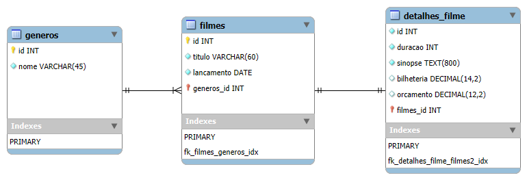

# EXERCICIO 02 

## No phpMyAdmin utilizando comandos SQL para fazer a Modelagem Física do exercício anterior (Catálogo de Filmes).

+ Criar um novo banco de dados (Catálogo de Filmes)
+ Criar três tabelas, conforme a modelagem feita em seu exercício anterior
    
+ Fazer o relacionamento entre as tabelas, definindo a ligação entre chaves estrageiras e primárias.


### Criando base de dados
``` sql
CREATE DATABASE catalogo_filmes CHARACTER SET utf8mb4;
```

### Criando tabela generos
``` sql
CREATE TABLE generos(
	id INT NOT NULL PRIMARY KEY AUTO_INCREMENT,
    nome VARCHAR(45) NOT NULL 
);
```

### Criando tabela filmes
``` sql
CREATE TABLE filmes(
	id_filmes INT NOT NULL PRIMARY KEY AUTO_INCREMENT,
    titulo VARCHAR (60) NOT NULL,
    lancamento DATE NOT NULL,
    genero_id INT NOT NULL 
);
```

### Criando tabela detalhes
``` sql
CREATE TABLE detalhes(
	id_detalhes INT NOT NULL PRIMARY KEY AUTO_INCREMENT,
    duracao INT NOT NULL,
    sinopse TEXT(800) NOT NULL,
    bilheteria DECIMAL(14,2) NULL,
    orcamento DECIMAL(12,2) NULL,
    filmes_ID INT NOT NULL 
);
```

### Criando relacionamentos 
#### Filmes > Generos 
``` sql
ALTER TABLE filmes
    ADD CONSTRAINT fk_filmes_generos
    FOREIGN KEY (genero_id) REFERENCES generos(id);
```

#### Detalhes > Filmes
``` sql
ALTER TABLE detalhes
	ADD CONSTRAINT fk_detalhes_filmes
    FOREIGN KEY (filme_ID) REFERENCES filmes(id_filmes);
```